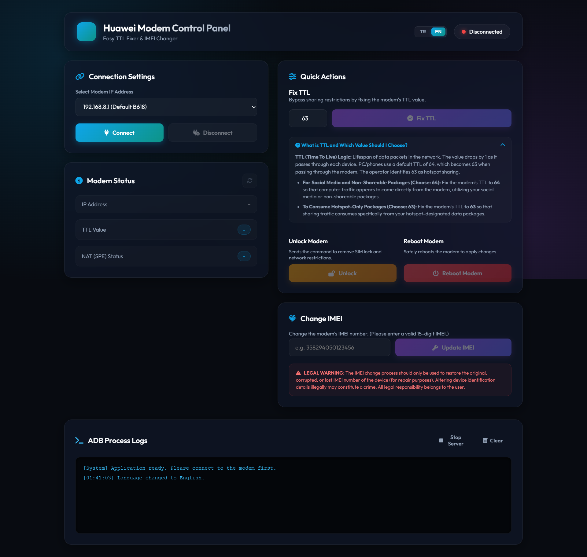

# 📡 Huawei Modem Kolay TTL & IMEI Değiştirici (Control Panel)

[](https://github.com/alielcbk/huawei-ttl-changer/archive/refs/heads/main.zip)


Huawei modemlerinizin TTL değerlerini sabitlemek, IMEI ayarlarını güncellemek ve SIM kilitlerini açmak için modern ve şık bir arayüze sahip web tabanlı yerel yönetim uygulaması.

This is a web-based local desktop application designed to easily fix TTL values, update IMEI settings (for repair purposes), and unlock SIM locks on Huawei modems.

---

### 🖥️ Arayüz Görseli (Interface Screenshot)


---

## ✨ Özellikler (Features)

*   🌐 **Çift Dil Desteği (TR / EN):** Arayüzün sağ üst köşesinden dinamik olarak Türkçe ve İngilizce dilleri arasında geçiş yapabilirsiniz.
*   🚀 **TTL Sabitleme (TTL Fixing):**
    *   **Değer: 64** $\rightarrow$ Sosyal medya (Instagram, YouTube vb.) ve paylaşılamayan paketlerinizi bilgisayarınızda sanki doğrudan modemden giriyormuş gibi kullanmak için.
    *   **Değer: 63** $\rightarrow$ Operatörlerin sadece hotspot (paylaşım) tanımlı paketlerini bilgisayarınızda tüketmek için.
*   🔧 **IMEI Güncelleme (IMEI Changer):** Cihazın orijinal kimliğini tamir amaçlı geri yüklemek için 15 haneli form kontrolüyle güvenli IMEI yazma.
*   🔓 **SIM Kilit Açma (Modem Unlock):** Şebeke kısıtlamalarını kaldırma komutlarını tek tıkla gönderme.
*   🔄 **Modem Yeniden Başlatma:** Ayarların aktif olması için modemi güvenli şekilde yeniden başlatma komutu.
*   📟 **Canlı ADB Terminali:** Arka planda çalışan ADB işlemlerinin tüm çıktılarını canlı olarak arayüzdeki terminal kutusundan izleme.
*   🎨 **Premium Tasarım:** Koyu tema (Dark Mode) üzerine kurulmuş modern Glassmorphism (cam efekti) tasarımı ve yumuşak geçiş efektleri.

---

## 🛠️ Kurulum ve Çalıştırma (Setup & Run)

### Gereksinimler (Requirements)
*   [Node.js](https://nodejs.org/) (Sürüm 16 veya üzeri tavsiye edilir)

### Çalıştırma (Running)
1. Proje klasöründeki `baslat.bat` dosyasına çift tıklayın.
2. Betik, gerekli Express/Open kütüphanelerini otomatik yükleyecek, sunucuyu başlatacak ve web tarayıcınızı otomatik olarak `http://localhost:3000` adresinde açacaktır.

---

## 📂 Proje Yapısı (Project Structure)

```text
├── bin/
│   ├── adb.exe             # ADB yürütülebilir dosyası
│   ├── AdbWinApi.dll       # ADB bağımlılık kütüphanesi
│   └── AdbWinUsbApi.dll    # USB sürücü kütüphanesi
├── public/
│   ├── index.html          # Türkçe ve İngilizce uyumlu ana arayüz dosyası
│   ├── style.css           # Premium Glassmorphism CSS tasarımı
│   ├── app.js              # Dil değiştirme, form doğrulama ve API kontrol kodları
│   └── screenshot.png      # Arayüz ekran görüntüsü
├── .gitignore              # Git tarafından izlenmeyecek dosyalar listesi
├── baslat.bat              # Tek tıkla otomatik modül yükleme ve çalıştırma betiği
├── package.json            # Proje bağımlılıkları (Express, Open)
└── server.js               # Node.js Express ADB API backend sunucusu


⚠️ Yasal Uyarı (Legal Warning)
TR: IMEI değiştirme işlemi yalnızca cihazın bozulan veya kaybolan orijinal IMEI numarasını geri yüklemek (tamir amaçlı) için kullanılmalıdır. Cihazların kimlik bilgilerini yasal olmayan yollarla değiştirmek suç teşkil edebilir. Bu işlemin tüm yasal sorumluluğu tamamen kullanıcıya aittir.

EN: The IMEI change process should only be used to restore the original, corrupted, or lost IMEI number of the device (for repair purposes). Altering device identification details illegally may constitute a crime. All legal responsibility belongs to the user.

